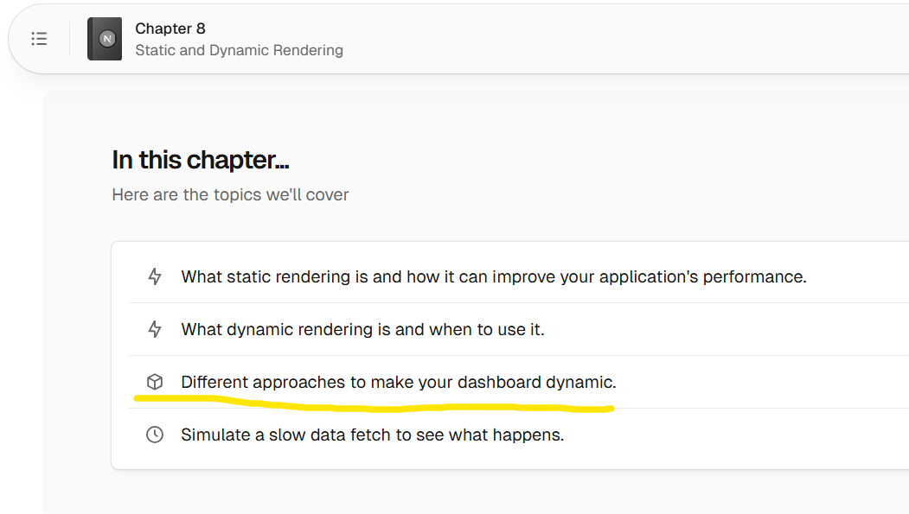
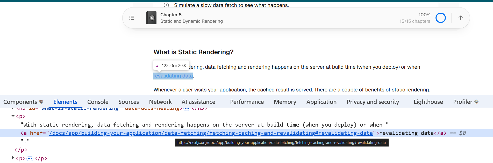
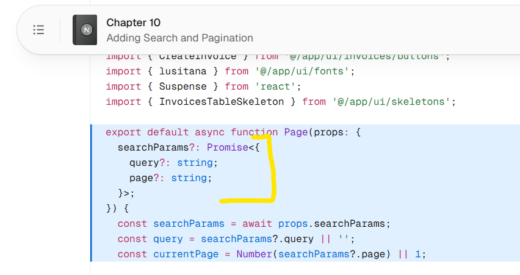
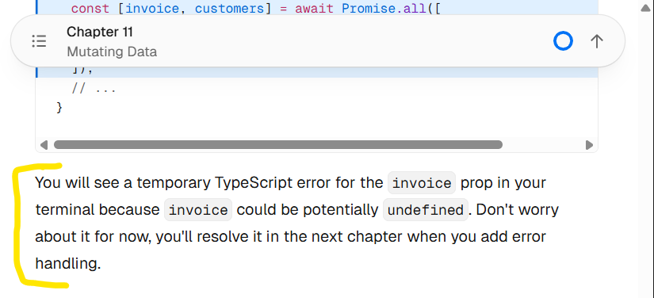

## Feedback

1. [Chapter 8](https://nextjs.org/learn/dashboard-app/static-and-dynamic-rendering)

    - In the chapter topics, third topic "Different approaches to make your dashboard dynamic." appears to be misleading as there is no such related content in the page.

        

---

2. [Chapter 8 >> #what-is-static-rendering](https://nextjs.org/learn/dashboard-app/static-and-dynamic-rendering#what-is-static-rendering)

    - "revalidating data." link doesn't redirect to correct docs page. I believe it should redirect to https://nextjs.org/docs/app/getting-started/caching-and-revalidating.

        

---

3. [Chapter 10 >> #4-updating-the-table](https://nextjs.org/learn/dashboard-app/adding-search-and-pagination#4-updating-the-table)
    - In solution (code snippet), instead of manually declaring the type for the `Page` component props, we can use the `PageProps` type. 

        
        ```tsx
        export default async function Page(
        	props: PageProps<'/dashboard/invoices'>,
        ) {
        	const searchParams = await props.searchParams;
        	// ...
        }
        ```

    - Similarly, the `PageProps` type should have been used in solution at [Chapter 11 >> #2-read-the-invoice-id-from-page-param](https://nextjs.org/learn/dashboard-app/mutating-data#2-read-the-invoice-id-from-page-params)

        ```tsx
        export default async function Page(
        	props: PageProps<'/dashboard/invoices'>,
        ) {
        	const params = await props.params;
        	const id = params.id;
        	// ...
        }
        ```
---

4. [Chapter 12 >> #adding-trycatch-to-server-actions](https://nextjs.org/learn/dashboard-app/error-handling#adding-trycatch-to-server-actions)
    - In solution, form actions `createInvoice` and `updateInvoice` are returning objects which is not expected type of `FormHTMLAttributes['action']`.

    - Intimate user that now error will appear on `action` prop of form in `/app/ui/invoices/create-form.tsx` that was created in [Chapter 11 >> #2-create-a-server-action](https://nextjs.org/learn/dashboard-app/mutating-data#2-create-a-server-action) due to return type mismatch.

    - Suggest user to either ignore this error (as this will be fixed later in [Chapter 12 >> #improving-accessibility](https://nextjs.org/learn/dashboard-app/improving-accessibility) by using `useActionState` to get the action prop value) or throw an error instead of returning an object.

    > **Note:** Similar issue was in Chapter 11 but the intimation was given to user there.
    > 
