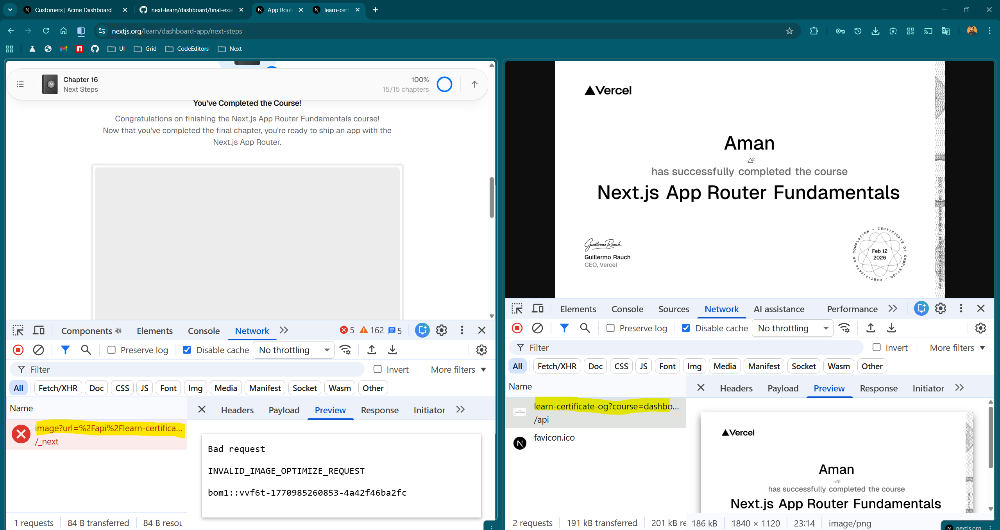

# Feedback

## 1. [Chapter 8](https://nextjs.org/learn/dashboard-app/static-and-dynamic-rendering)

-   In the chapter topics, the third topic, **"Different approaches to
    make your dashboard dynamic."**, appears to be misleading, as there
    is no corresponding content covering this topic on the page.

    

------------------------------------------------------------------------

## 2. [Chapter 8 → #what-is-static-rendering](https://nextjs.org/learn/dashboard-app/static-and-dynamic-rendering#what-is-static-rendering)

-   The **"revalidating data."** link does not redirect to the correct
    documentation page.

    
    
    It should likely point to:\
    https://nextjs.org/docs/app/getting-started/caching-and-revalidating 
    
    OR 

    https://nextjs.org/docs/app/guides/incremental-static-regeneration

    

------------------------------------------------------------------------

## 3. [Chapter 10 → #4-updating-the-table](https://nextjs.org/learn/dashboard-app/adding-search-and-pagination#4-updating-the-table)

-   In the solution code snippet, instead of manually declaring the type
    for the `Page` component props, the `PageProps` utility type could
    be used.

    

-   Alternatively, the course should inform learners that `PageProps` is
    available in newer versions of Next.js (https://nextjs.org/docs/app/guides/upgrading/version-16#migrating-types-for-async-dynamic-apis).


    ``` tsx
    export default async function Page(
      props: PageProps<'/dashboard/invoices'>,
    ) {
      const searchParams = await props.searchParams;
      // ...
    }
    ```

-   Similarly, the `PageProps` type could be used or mentioned in the
    solution at\
    [Chapter 11 →
    #2-read-the-invoice-id-from-page-params](https://nextjs.org/learn/dashboard-app/mutating-data#2-read-the-invoice-id-from-page-params)

    ``` tsx
    export default async function Page(
      props: PageProps<'/dashboard/invoices'>,
    ) {
      const params = await props.params;
      const id = params.id;
      // ...
    }
    ```

------------------------------------------------------------------------

## 4. [Chapter 12 → #adding-trycatch-to-server-actions](https://nextjs.org/learn/dashboard-app/error-handling#adding-trycatch-to-server-actions)

-   In the solution, the `createInvoice` and `updateInvoice` server
    actions return objects, which do not match the expected type of
    `FormHTMLAttributes['action']`.

-   The course should inform users that this will temporarily cause a
    type error on the `action` prop in:

    `/app/ui/invoices/create-form.tsx`\
    (created in [Chapter 11 \>\>
    #2-create-a-server-action](https://nextjs.org/learn/dashboard-app/mutating-data#2-create-a-server-action))

-   Learners should be advised to either:

    -   Ignore the type error temporarily (as it will be resolved later
        in [Chapter 12 \>\>
        #improving-accessibility](https://nextjs.org/learn/dashboard-app/improving-accessibility)
        using `useActionState`), or
    -   Throw an error instead of returning an object to maintain type
        compatibility.

> **Note:** A similar clarification was provided in Chapter 11. Adding
> the same level of guidance here would improve consistency.
>
> 

------------------------------------------------------------------------

## 5. [Chapter 16](https://nextjs.org/learn/dashboard-app/next-steps) 
- Content related to the final implementation of the Customers page (app/dashboard/customers/page.tsx) is missing in the course. At the very least, there should be a note or comment encouraging learners to complete it as a self-exercise.

## 6. [Chapter 16 → #share-your-nextjs-app](https://nextjs.org/learn/dashboard-app/next-steps#share-your-nextjs-app)
- Certificate image link is not working. 




> Note: The image source URL works correctly when accessed directly without image optimization.
